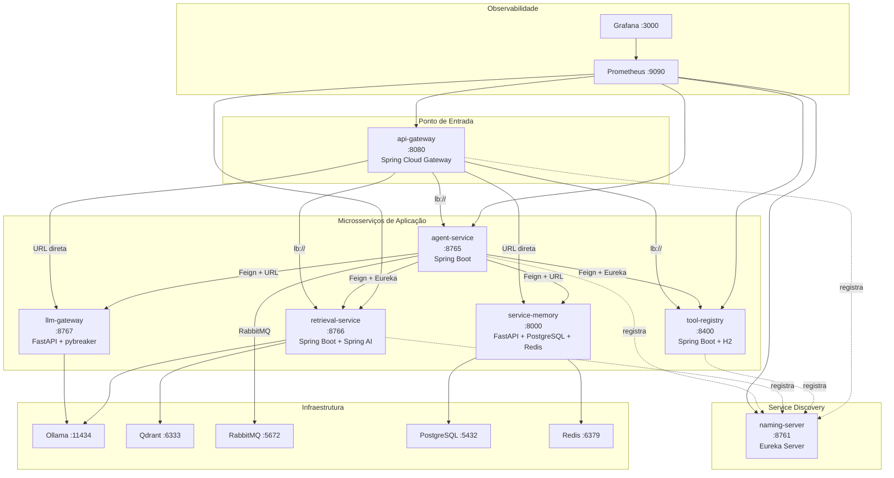

# 🔍 Análise Completa do Projeto — Leitura de Todo o Código

> **Data:** 06/07/2026 — 22:07
> **Método:** Leitura de todos os arquivos-fonte, configs, Dockerfiles, pom.xml, requirements.txt e compose.yaml

---

## 1. Mapa da Arquitetura (O Que Existe)

---

## 2. Checklist dos Requisitos do PDF vs. Código Real

| # | Requisito do PDF | Status | Evidência no código |
|:-:|:---|:---:|:---|
| **(a)** | Arquitetura de microsserviços | ✅ | 7 serviços independentes, cada um com Dockerfile e build próprio |
| **(b)** | Comunicação Síncrona (REST/Feign) | ✅ | 4 Feign Clients em [agent-service/feign/](file:///home/indiligente/Desktop/projects/trabalhoESII/agent-service/src/main/java/TF_ESII/TF/feign): `LlmGatewayClient`, `MemoryServiceClient`, `ToolRegistryClient`, `RetrievalServiceClient` |
| **(c)** | Comunicação Assíncrona (RabbitMQ) | ✅ | **Produtor:** [AgentService.java](file:///home/indiligente/Desktop/projects/trabalhoESII/agent-service/src/main/java/TF_ESII/TF/agent/AgentService.java#L139-L151) publica na fila `agent.telemetry`. **Consumidor:** [TelemetryConsumer.java](file:///home/indiligente/Desktop/projects/trabalhoESII/agent-service/src/main/java/TF_ESII/TF/telemetry/TelemetryConsumer.java) com `@RabbitListener`. **Config:** [TelemetryRabbitConfig.java](file:///home/indiligente/Desktop/projects/trabalhoESII/agent-service/src/main/java/TF_ESII/TF/config/TelemetryRabbitConfig.java) com fila durável e `Jackson2JsonMessageConverter`. |
| **(d)** | Resiliência (Circuit Breaker) | ✅ | [AgentExternalServices.java](file:///home/indiligente/Desktop/projects/trabalhoESII/agent-service/src/main/java/TF_ESII/TF/agent/AgentExternalServices.java): 5 métodos com `@CircuitBreaker` + fallbacks para `llmGateway`, `memoryService`, `toolRegistry`, `retrievalService`. [AgentTools.java](file:///home/indiligente/Desktop/projects/trabalhoESII/agent-service/src/main/java/TF_ESII/TF/agent/AgentTools.java#L20-L34): CircuitBreaker no RAG. [ollama.py](file:///home/indiligente/Desktop/projects/trabalhoESII/llm-gateway/app/services/ollama.py#L5): `pybreaker` no llm-gateway. Config Resilience4J em [application.yaml](file:///home/indiligente/Desktop/projects/trabalhoESII/agent-service/src/main/resources/application.yaml#L30-L50). |
| **(e)** | Service Discovery (Eureka) | ✅ | [NamingServerApplication.java](file:///home/indiligente/Desktop/projects/trabalhoESII/naming-server/src/main/java/TF_ESII/naming_server/NamingServerApplication.java) com `@EnableEurekaServer`. Todos os serviços Spring registram-se com `eureka.client.register-with-eureka: true`. |
| **(f)** | API Gateway | ✅ | [api-gateway/application.yaml](file:///home/indiligente/Desktop/projects/trabalhoESII/api-gateway/src/main/resources/application.yaml): 5 rotas configuradas com `StripPrefix=1`. Usa `lb://` para serviços Spring e URL direta para Python. |
| **(g)** | Observabilidade | ✅ | [prometheus.yml](file:///home/indiligente/Desktop/projects/trabalhoESII/observability/prometheus.yml): scrapes de 5 serviços. Grafana provisionado com [datasource](file:///home/indiligente/Desktop/projects/trabalhoESII/observability/grafana/provisioning/datasources/prometheus.yml). `micrometer-registry-prometheus` em todos os `pom.xml`. |
| **(h)** | Docker Compose | ✅ | [compose.yaml](file:///home/indiligente/Desktop/projects/trabalhoESII/compose.yaml): 16 serviços, healthchecks, depends_on com conditions, rede bridge compartilhada, volumes nomeados. |

> [!IMPORTANT]
> **Todos os 8 requisitos técnicos do PDF estão implementados no código.** A implementação está completa.

---

## 3. Análise Detalhada por Microsserviço

### 3.1 agent-service (Orquestrador Principal)

| Aspecto | Detalhe |
|:---|:---|
| **Ciclo ReAct** | Loop de até 10 iterações em [AgentService.java](file:///home/indiligente/Desktop/projects/trabalhoESII/agent-service/src/main/java/TF_ESII/TF/agent/AgentService.java#L66-L113). Chama LLM, interpreta `tool_calls`, executa ferramentas, volta ao LLM. |
| **Ferramentas locais** | `buscarNaBaseDeConhecimento` (RAG) e `obterDataHoraAtual` em [AgentTools.java](file:///home/indiligente/Desktop/projects/trabalhoESII/agent-service/src/main/java/TF_ESII/TF/agent/AgentTools.java) |
| **Ferramentas remotas** | Delegadas ao `tool-registry` via Feign |
| **Memória** | Persiste histórico via Feign → `service-memory` |
| **Telemetria** | Publica `sessionId`, `iteracao`, `duracaoMs`, `finishReason`, `timestamp` no RabbitMQ |
| **Circuit Breakers** | 5 instâncias Resilience4J com fallbacks individuais |
| **Endpoints** | `/api/agent/chat`, `/api/agent/nova-sessao`, `/api/agent/health`, `/api/agent/debug/retrieval` |

### 3.2 llm-gateway (FastAPI + Ollama)

| Aspecto | Detalhe |
|:---|:---|
| **Framework** | FastAPI com schema Pydantic |
| **LLM** | Ollama AsyncClient, modelo configurável via `LLM_MODEL` (atualmente `qwen2.5:0.5b`) |
| **Circuit Breaker** | `pybreaker` com `fail_max=3`, `reset_timeout=30s` |
| **Tool calling** | Repassa `availableTools` ao Ollama e extrai `tool_calls` da resposta |

### 3.3 retrieval-service (RAG)

| Aspecto | Detalhe |
|:---|:---|
| **Framework** | Spring Boot + Spring AI |
| **Vector Store** | Qdrant via `spring-ai-starter-vector-store-qdrant` |
| **Embeddings** | `nomic-embed-text` via Ollama |
| **Endpoints** | `POST /api/retrieval/documents` (indexar), `POST /api/retrieval/search` (buscar), `GET /api/retrieval/health` |

### 3.4 tool-registry

| Aspecto | Detalhe |
|:---|:---|
| **Banco** | H2 in-memory com JPA |
| **Ferramentas built-in** | `calculator`, `database-query`, `echo`, `datetime` |
| **CRUD** | Registro, listagem, atualização, exclusão e execução de ferramentas |
| **Endpoints** | `GET /tools`, `GET /tools/{name}`, `POST /tools`, `PUT /tools/{name}`, `DELETE /tools/{name}`, `POST /tools/{name}/execute` |

### 3.5 service-memory (FastAPI + PostgreSQL + Redis)

| Aspecto | Detalhe |
|:---|:---|
| **Persistência** | PostgreSQL (async via `asyncpg`) |
| **Cache** | Redis com TTL de 1 hora, invalidação no POST |
| **Migrations** | Alembic com migration `615a21a8cf04_criacao_tabela_memories` |
| **Contrato** | `GET /api/memory/{sessionId}` retorna `List[{role, content}]`, `POST /api/memory/{sessionId}` recebe `{role, content}` — compatível com `LlmMessage` do Java |
| **Healthcheck** | `GET /health` |

### 3.6 naming-server (Eureka)

- Classe única `NamingServerApplication` com `@EnableEurekaServer`
- Config limpa sem conflitos de merge
- Actuator + Prometheus habilitados

### 3.7 api-gateway (Spring Cloud Gateway)

- 5 rotas: `agent-service`, `retrieval-service`, `tool-registry`, `llm-gateway`, `service-memory`
- Serviços Spring via `lb://` (load balancer via Eureka)
- Serviços Python via URL direta (variáveis de ambiente)
- Registra-se no Eureka

---

## 4. Problemas e Pontos de Atenção Encontrados

### 4.1 Código morto em [AgentService.java](file:///home/indiligente/Desktop/projects/trabalhoESII/agent-service/src/main/java/TF_ESII/TF/agent/AgentService.java#L123-L160)

O método `executarFerramenta(String, String)` (linhas 123-132) e `extrairParametro(String, String)` (linhas 153-160) são **código morto** — nunca são chamados. O fluxo atual usa `externalServices.executeTool()` e extração via `Map` em vez de parsing manual de JSON. Podem ser removidos sem impacto.

### 4.2 Inconsistência de versões entre serviços

| Serviço | Spring Boot | Spring Cloud |
|:---|:---|:---|
| `agent-service` | **4.0.6** | 2025.1.1 |
| `api-gateway` | **4.1.0** | 2025.1.2 |
| `naming-server` | **4.1.0** | 2025.1.2 |
| `retrieval-service` | **4.0.6** | 2025.1.1 |
| `tool-registry` | **3.4.1** | 2024.0.1 |

> [!WARNING]
> O `tool-registry` usa Spring Boot **3.4.1** com Spring Cloud **2024.0.1**, enquanto os outros estão em 4.x. Isso **funciona** porque cada serviço roda isolado no seu container, mas pode causar confusão para o professor e aparentar falta de padronização.

### 4.3 Arquivos de lixo no repositório

Os seguintes arquivos provavelmente não devem ir para a entrega final:

- `test.txt` (4KB) — logs de teste
- `novo_test.txt` — testes avulsos
- `log.txt`, `api-gateway-logs.txt`, `rea.txt` — já foram removidos do repositório pelo que vi
- `status_projeto.md` — documento de acompanhamento interno
- `COMO_EXECUTAR.md` — já foi deletado, precisa ser reescrito se necessário

### 4.4 README.md está defasado

O [README.md](file:///home/indiligente/Desktop/projects/trabalhoESII/README.md) tem apenas 10 linhas com commits antigos. Deveria documentar:
- Arquitetura e diagrama
- Como executar (`docker compose up`)
- URLs dos painéis (Eureka, RabbitMQ, Grafana)
- Comandos de teste

### 4.5 Sem `MEMORY_SERVICE_URL` no env do agent-service no compose

O [MemoryServiceClient.java](file:///home/indiligente/Desktop/projects/trabalhoESII/agent-service/src/main/java/TF_ESII/TF/feign/MemoryServiceClient.java#L11) usa `${MEMORY_SERVICE_URL:http://service-memory:8000}`, e o valor default (`http://service-memory:8000`) funciona porque o nome do container no compose é `service-memory`. Isso está funcionando, mas seria mais explícito declarar a variável no compose como fazemos com `LLM_GATEWAY_URL`.

### 4.6 `ToolRegistryClient` usa Eureka sem URL direta

O [ToolRegistryClient.java](file:///home/indiligente/Desktop/projects/trabalhoESII/agent-service/src/main/java/TF_ESII/TF/feign/ToolRegistryClient.java#L13) usa `@FeignClient(name = "tool-registry")` **sem `url`**, o que significa que ele resolve pelo Eureka. Funciona quando o Eureka está UP. Se o Eureka cair, o Circuit Breaker do `toolRegistry` entra em ação (fallback retorna lista vazia de ferramentas).

Da mesma forma, o [RetrievalServiceClient.java](file:///home/indiligente/Desktop/projects/trabalhoESII/agent-service/src/main/java/TF_ESII/TF/feign/RetrievalServiceClient.java#L10) também depende exclusivamente do Eureka.

Isso é na verdade uma **boa prática** para demonstrar o Service Discovery — não é um problema.

---

## 5. Veredito Final

> [!NOTE]
> **O projeto está funcionalmente completo.** Todos os 8 requisitos técnicos do PDF possuem implementação real no código.

O que falta não é de código, mas sim de **documentação e polimento para entrega**:

| # | Tarefa | Prioridade | Tempo estimado |
|:-:|:---|:---:|:---:|
| 1 | Reescrever o **README.md** com instruções claras de execução | 🔴 Alta | ~15 min |
| 2 | Remover **código morto** (`executarFerramenta` e `extrairParametro` no AgentService) | 🟡 Média | ~2 min |
| 3 | Limpar **arquivos de lixo** (`test.txt`, `novo_test.txt`, `status_projeto.md` etc.) antes do commit final | 🟡 Média | ~5 min |
| 4 | Preparar o **roteiro de demonstração** para o vídeo do YouTube | 🔴 Alta | ~20 min |
| 5 | Escrever o **relatório técnico** com justificativas de arquitetura e análise de evolução para K8s | 🔴 Alta | ~30 min |
| 6 | Desenhar o **diagrama de arquitetura** final | 🔴 Alta | ~15 min |

